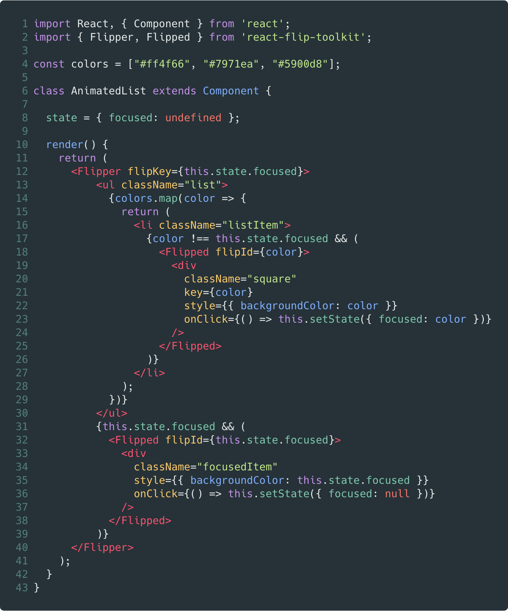
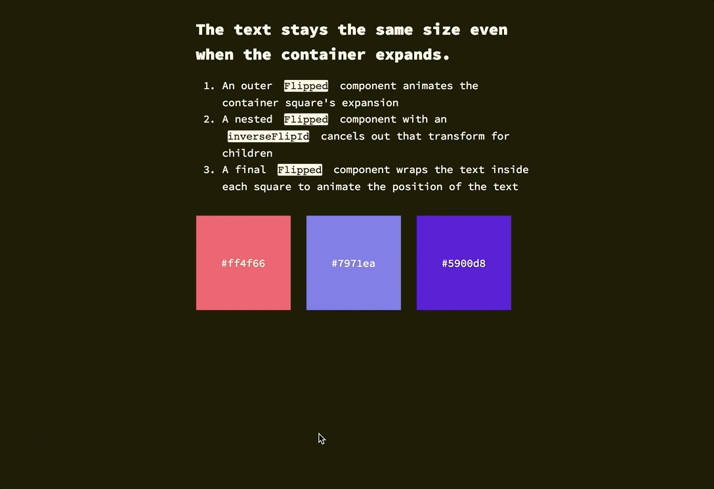

# react-flip-toolkit

<a href="https://codepen.io/aholachek/pen/ERRpEj">

</a>

### Comparison with other React FLIP libraries

| Feature                                        | `react-flip-move` | `react-overdrive` | `react-flip-toolkit` |
| ---------------------------------------------- | :---------------: | :---------------: | :------------------: |
| Animate position                               |        ✅         |        ✅         |          ✅          |
| Animate size                                   |        ❌         |        ✅         |          ✅          |
| Animate opacity                                |        ❌         |        ✅         |          ✅          |
| Animate parent's size without warping children |        ❌         |        ❌         |          ✅          |
| Use real FLIP instead of cloning & crossfading |        ✅         |        ❌         |          ✅          |
| Enable nested animations                       |        ❌         |        ❌         |          ✅          |
| Easy to set up & beginner-friendly             |        ✅         |        ✅         |          🤷          |

### Demos

<p>
<a href="https://literate-fly.surge.sh/photos">
  
</a>
</p>

<p>
<a href="https://codepen.io/aholachek/pen/KeevYN">
  
</a>
</p>
<p>
<a href="https://codepen.io/aholachek/pen/gKjYNw?editors=0110">
  
</a>
</p>

- [Simplest possible example](https://codepen.io/aholachek/pen/RJvPjL)
- [Guitar shop](https://literate-fly.surge.sh/guitar)
- [Absurd, overly complex, nested example](https://literate-fly.surge.sh/cards)
- [React-flip-toolkit logo](https://codepen.io/aholachek/pen/ERRpEj)

### Why use React-Flip-Toolkit?

## Quick start

`npm install react-flip-toolkit`

`import { Flipper, Flipped } from 'react-flip-toolkit'`

Wrap your container element with a `Flipper` component that has a `flipKey` prop that changes every time an animation should happen.

Wrap elements that should be animated with `Flipped` components that have `flipId` props matching them across renders.

## Simplest example: Tweening a single element

<a href="https://codepen.io/aholachek/pen/RJvPjL">
  
</a>

(click to view on codepen)

## More useful but slightly less simple: Transitioning two elements

The power of FLIP lies in smoothly tweening two completely separate elements to appear as if they are one:

<a href="https://codepen.io/aholachek/pen/zapEjq">
  
</a>

## The Components

### 1. Flipper component

The parent wrapper component that contains all the elements to be animated:

```js
<Flipper flipKey={someKeyThatChanges}>
  {/* children wrapped in Flipped components*/}
</Flipper>
```

| prop                    |                    default                     | type                       | details                                                                                                                                                                                                                                         |
| ----------------------- | :--------------------------------------------: | :------------------------- | :---------------------------------------------------------------------------------------------------------------------------------------------------------------------------------------------------------------------------------------------- |
| flipKey **(required)**  |                                                | `string`, `number`, `bool` | Changing this tells `react-flip-toolkit` to transition child elements wrapped in `Flipped` components.                                                                                                                                          |
| children **(required)** |                                                | `node`                     | One or more element children                                                                                                                                                                                                                    |
| spring                  | `{stiffness: 1000`, `damping: 500`, `mass: 3}` | `object`                   | **The default easing for all transitions uses springs**. You can customize the spring by changing the `stiffness`, `damping`, or `mass` values. If you provide an `ease` prop (described below), that will be used instead instead of a spring. |
| ease                    |                 `easeOutExpo`                  | `string`                   | Set the default easing for all FLIP transitions: [Interactive explorer for all easing options](https://codepen.io/aholachek/full/bKmZbV/)                                                                                                       |
| duration                |                     `250`                      | `number`                   | Default duration in ms for all FLIP transitions that use the `ease` prop instead of the default `spring` (which uses a physics simulation and therefore doesn't require a duration)                                                             |
| applyTransformOrigin    |                     `true`                     | `bool`                     | Whether or not `react-flip-toolkit` should apply a transform-origin of "0 0" to animating children (this is generally desirable for FLIP animations)                                                                                            |

### 2. Flipped component

A component that wraps an element that needs to be animated.

E.g. in one component you can have

```js
<Flipped flipId="coolDiv">
  <div className="small" />
</Flipped>
```

and in another component somewhere else you can have

```js
<Flipped flipId="coolDiv">
  <div className="big" />
</Flipped>
```

and they will be tweened by `react-flip-toolkit`.

| prop                     |                    default                     | type     | details                                                                                                                                                                                                                                                                         |
| ------------------------ | :--------------------------------------------: | :------- | :------------------------------------------------------------------------------------------------------------------------------------------------------------------------------------------------------------------------------------------------------------------------------ |
| children **(required)**  |                                                | `node`   | Wrap a single child with the `Flipped` component. If the child is a React component, make sure it passes down unknown props directly to the rendered DOM element so that `Flipped` can pass down the necessary `data-*` attributes.                                             |
| flipId **(required)**    |                                                | `string` | Use this to tell `react-flip-toolkit` how elements should be matched across renders so they can be animated.                                                                                                                                                                    |
| inverseFlipId            |                                                | `string` | Refer to the id of the parent `Flipped` container whose transform you want to cancel out. [Read more about canceling out parent transforms here](#scale-transitions-made-easier)                                                                                                |
| transformOrigin          |                    `"0 0"`                     | `string` | This is a convenience method to apply the proper CSS `transform-origin` to the element being FLIP-ped. This will override `react-flip-toolkit`'s default application of `transform-origin: 0 0` if it is provided as a prop.                                                    |
| spring                   | `{stiffness: 1000`, `damping: 500`, `mass: 3}` | `object` | This prop allows you to customize the spring easing on a per-component basis. You can change the `stiffness`, `damping`, or `mass` values by providing them in the prop object. If you provide an `ease` prop (described below), that will be used instead instead of a spring. |
| ease                     |                 `easeOutExpo`                  | `string` | This string should refer to [one of the available easing options](https://codepen.io/aholachek/full/bKmZbV/). This prop will override the easing specified in the parent `Flipped` component.                                                                                   |
| duration                 |                     `250`                      | `number` | Timing for the individual FLIP transition, \*\*this is only meaningful if you've specified an `ease` prop, because springs don't take durations. This prop will override the one specified in the parent `Flipped` component                                                    |
| delay                    |                      `0`                       | `number` | Amount of time to wait before tweening the element position.                                                                                                                                                                                                                    |
| onAppear(element, index) |                                                | `func`   | Called when the element first appears. It is provided a reference to the DOM element being transitioned as the first argument, and the index of the element relative to all appearing elements as the second.                                                                   |
| onStart(element)         |                                                | `func`   | Called when the FLIP animation starts. It is provided a reference to the DOM element being transitioned as the first argument                                                                                                                                                   |
| onComplete(element)      |                                                | `func`   | Called when the FLIP animation completes. It is provided a reference to the DOM element being transitioned as the first argument. (If transitions are interruped by new ones, `onComplete` will still be called.)                                                               |

#### By default the FLIP-ped elements' translate, scale, and opacity properties are all transformed. However, certain effects require more control so if you specify any of these props, _only the specified attribute(s) will be tweened_:

| prop      |  type  | details                             |
| --------- | :----: | :---------------------------------- |
| translate | `bool` | Tween `translateX` and `translateY` |
| scale     | `bool` | Tween `scaleX` and `scaleY`         |
| opacity   | `bool` |                                     |

#### Advanced and usually unnecessary:

| prop              |       type       | details                                                                                                                                                                                                                                                                                                                                     |
| ----------------- | :--------------: | :------------------------------------------------------------------------------------------------------------------------------------------------------------------------------------------------------------------------------------------------------------------------------------------------------------------------------------------ |
| componentId       |     `string`     | Unique identifier for the component                                                                                                                                                                                                                                                                                                         |
| componentIdFilter | `array`,`string` | Only apply FLIP transitions if the transition originates or ends with a component with the specified `componentId`. To limit the application of an inverse transform, you refer to the parent's `componentId` [as seen in this example.](https://github.com/aholachek/react-flip-toolkit/blob/master/demo/src/CardsExample/UserGrid.js#L44) |

## Scale transitions made eas(ier)

Try it out on Codepen:

<a href="https://codepen.io/aholachek/pen/mKXBJR?editors=0110">

</a>

Some other FLIP libraries just allow you to animate position changes, but things get a lot more interesting [once you can animate scale changes as well](#demos).

The problem with scale animations has to do with children -- if you scale a div up 2x, you will warp any children it has by scaling them up too, creating a weird-looking animation. That's why this library allows you to wrap the child with a `Flipped` component that has an `inverseFlipId` to counteract the transforms of the parent:

```js
<Flipped flipId={parentFlipId}>
  <div>
    <Flipped inverseFlipId={parentFlipId} scale>
      <div>some text that will not be warped</div>
    </Flipped>
  </div>
</Flipped>
```

By default, not only the scale of the parent will be counteracted, but also the translations (this allows children components to make their own FLIP animations without being affected by the parent).
But for many/most use cases, you'll want to additionally specify the `scale` prop to limit the adjustment to the scale and allow the positioning to move with the parent.

## Other details

- ~10.2kb minified and gzipped
- React 16+
- Tested in latest Chrome, Firefox, Safari, and Edge, with acceptable performance in IE 11

## FAQ

- **Why isn't anything animating?** Make sure you're updating the `flipKey` attribute in the `Flipper` component whenever an animation should happen.

- **Why does my animation look "off"?** Try increasing the duration to something ridiculous like `10000` so that you can catch every detail. When the animations happen quickly it's hard to consciously spot little issues that can interfere with the final effect.

- **Why is the element animating from or to an unexpected position?** At any point, there can only be one element with a specified `flipId` on the page. If there are multiple `Flipped` elements on the page with the same id, things will start to get weird. Check to make sure all `flipId`s are unique.
