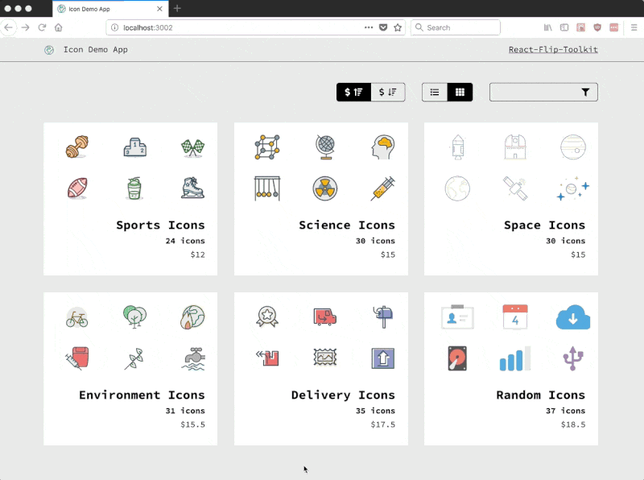
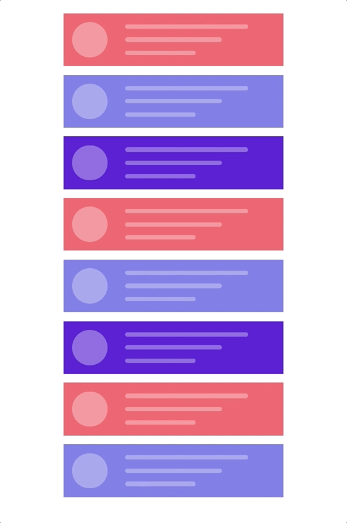

<p align="center">
  <a href="https://codepen.io/aholachek/pen/ERRpEj">
  
  </a>
</p>

[](https://travis-ci.com/aholachek/react-flip-toolkit)
[](
  https://bundlephobia.com/result?p=react-flip-toolkit
)

**Comparison with other React FLIP libraries**

| Feature                                        | [`react-flip-move`](https://github.com/joshwcomeau/react-flip-move) | [`react-overdrive`](https://github.com/berzniz/react-overdrive) | `react-flip-toolkit` |
| ---------------------------------------------- | :-----------------------------------------------------------------: | :-------------------------------------------------------------: | :------------------: |
| Animate position                               | ✅                                                                   | ✅                                                               | ✅                    |
| Animate scale                                  | ❌                                                                   | ✅                                                               | ✅                    |
| Animate opacity                                | ❌                                                                   | ✅                                                               | ✅                    |
| Animate parent's size without warping children | ❌                                                                   | ❌                                                               | ✅                    |
| Use real FLIP instead of cloning & crossfading | ✅                                                                   | ❌                                                               | ✅                    |
| Use springs for animations                     | ❌                                                                   | ❌                                                               | ✅                    |
| Support spring-based stagger effects           | ❌                                                                   | ❌                                                               | ✅                    |


## Table of Contents
- [Demos](#demos)
- [Quick start](#quick-start)
  - [Expanding Div](#expanding-div-fork-on-code-sandbox)
  - [List Shuffle](#list-shuffle-fork-on-code-sandbox)
- [🆕 Interactive Tutorial](https://alex.holachek.com/rft-tutorial/)
- [The Components](#the-components)
  - [1. `Flipper`](#1-flipper)
    - [Basic Props](#basic-props)
    - [Advanced Props](#advanced-props)
  - [2. `Flipped`](#2-flipped)
    - [Basic props](#basic-props)
    - [Callback props](#callback-props)
    - [Transform props](#transform-props)
    - [Advanced props](#advanced-props)
- [Practical scale transitions](#practical-scale-transitions)
- [Library details](#library-details)
- [Troubleshooting](#troubleshooting)
  - [Problem #1: Nothing is happening](#problem-1-nothing-is-happening)
  - [Problem #2: Things look weird](#problem-2-things-look-weird)
  - [Problem #3: It's still not working](#problem-3-its-still-not-working)
- [Performance](#performance)
  - [1. `PureComponent`](#1-purecomponent)
  - [2. `will-change:transform`](#2-will-changetransform)

## Demos

<p>
<a href="https://react-flip-toolkit-demos.surge.sh/photos">
<h4>Image Transitions</h4>

  
</a>
</p>

<p>
<a href="https://github.com/aholachek/react-flip-toolkit-router-example">
<h4>Usage with React Router</h4>

  
</a>
</p>

<p>
<a href="https://codepen.io/aholachek/pen/KeevYN">
<h4>Stripe-Inspired Menu</h4>

  
</a>
</p>

<p>
<a href="https://codepen.io/aholachek/pen/jvvarq?editors=0110">
<h4>List Transition</h4>

  
</a>
</p>

<p>
<a href="https://codepen.io/aholachek/full/bKmZbV/">
<h4>Spring Options Explorer</h4>

  
</a>
</p>

- [Animated List (`react-flip-move` clone)](https://react-flip-toolkit-demos.surge.sh/flip-move)
- [Guitar shop](https://react-flip-toolkit-demos.surge.sh/guitar)
- [Overly complex, nested cards example](https://react-flip-toolkit-demos.surge.sh/cards)
- [React-flip-toolkit logo](https://codepen.io/aholachek/pen/ERRpEj)
- [Using Portals](https://react-flip-toolkit-demos.surge.sh/portal)


## Quick start

`npm install react-flip-toolkit` or `yarn add react-flip-toolkit`

1. Wrap your animations with a single `Flipper` component that has a `flipKey` prop that changes every time animations should happen.

2. Wrap elements that should be animated with `Flipped` components that have a `flipId` prop matching them across renders.

### Expanding Div ([Fork on Code Sandbox](https://codesandbox.io/s/j7klm66885))

```jsx
import React, { Component } from 'react';
import { Flipper, Flipped } from 'react-flip-toolkit';

class AnimatedSquare extends Component {
  state = { fullScreen: false };

  toggleFullScreen = () => {
    this.setState(prevState => ({
      fullScreen: !prevState.fullScreen
    }));
  };

  render() {
    return (
      <Flipper flipKey={this.state.fullScreen}>
        <Flipped flipId="square">
          <div
            className={this.state.fullScreen ? "full-screen-square" : "square"}
            onClick={this.toggleFullScreen}
          />
        </Flipped>
      </Flipper>
    );
  }
}
```

### List Shuffle ([Fork on Code Sandbox](https://codesandbox.io/s/14v8o5xy44))

```jsx
import React, { Component } from 'react';
import { Flipper, Flipped } from 'react-flip-toolkit';

class ListShuffler extends Component {
  state = { data: [1, 2, 3, 4, 5, 6, 7, 8, 9, 10] };

  shuffle = () =>
    this.setState(({ data }) => ({
      data: shuffle(data)
    }));

  render() {
    return (
      <Flipper flipKey={this.state.data.join("")}>
        <button onClick={this.shuffle}> shuffle</button>
        <ul className="list">
          {this.state.data.map(d => (
            <Flipped key={d} flipId={d}>
              <li>{d}</li>
            </Flipped>
          ))}
        </ul>
      </Flipper>
    );
  }
}
```

## The Components

### 1. `Flipper`

The parent wrapper component that contains all the elements to be animated. You'll most typically need only one of these per page.

```jsx
<Flipper flipKey={someKeyThatChanges}>
  {/* children */}
</Flipper>
```

#### Basic Props

| prop                    | default    | type                       | details                                                                                                                                                                                                                                                                                                                                                                                                         |
| ----------------------- | :--------: | :------------------------- | :-------------------------------------------------------------------------------------------------------------------------------------------------------------------------------------------------------------------------------------------------------------------------------------------------------------------------------------------------------------------------------------------------------------- |
| flipKey **(required)**  | -          | `string`, `number`, `bool` | Changing this tells `react-flip-toolkit` to transition child elements wrapped in `Flipped` components.                                                                                                                                                                                                                                                                                                          |
| children **(required)** | -          | `node`                     | One or more element children                                                                                                                                                                                                                                                                                                                                                                                    |
| spring                  | `noWobble` | `string` or `object`       | Provide a string referencing one of the spring presets &mdash; `noWobble` (default), `veryGentle`, `gentle`, `wobbly`, or `stiff`, OR provide an object with stiffness and damping parameters. [Explore the spring setting options here.](https://codepen.io/aholachek/full/bKmZbV/) The prop provided here will be the spring default that can be overrided on a per-element basis on the `Flipped` component. |
| applyTransformOrigin    | `true`     | `bool`                     | Whether or not `react-flip-toolkit` should apply a transform-origin of "0 0" to animating children (this is generally, but not always, desirable for FLIP animations)                                                                                                                                                                                                                                           |
| element                 | `div`      | `string`                   | If you'd like the wrapper element created by the `Flipped` container to be something other than a `div`, you can specify that here.                                                                                                                                                                                                                                                                             |
| className               | -          | `string`                   | A class applied to the wrapper element, helpful for styling.                                                                                                                                                                                                                                                                                                                                                    |
| staggerConfig           | -          | `object`                   | Provide configuration for staggered `Flipped` children. The config object might look something like the code snippet below:                                                                                                                                                                                                                                                                                     |

```js
staggerConfig={{
  // the "default" config will apply to staggered elements without explicit keys
      default: {
        // default direction is forwards
        reverse: true,
        // default is .1, 0 < n < 1
        speed: .5
      },
  // this will apply to Flipped elements with the prop stagger='namedStagger'
    namedStagger : { speed: .2 }
  }}
 ```


#### Advanced Props

 | prop                    | default | type       | details                                                                                                                                                                                                                                                                                                                                                                                                                                                                                                                                                                                                                                                                                                |
 | ----------------------- | :-----: | :--------- | :----------------------------------------------------------------------------------------------------------------------------------------------------------------------------------------------------------------------------------------------------------------------------------------------------------------------------------------------------------------------------------------------------------------------------------------------------------------------------------------------------------------------------------------------------------------------------------------------------------------------------------------------------------------------------------------------------- |
 | decisionData            | -       | `any`      | Sometimes, you'll want the animated children of `Flipper` to behave differently depending on the state transition &mdash; maybe only certain `Flipped` elements should animate in response to a particular change. By providing the `decisionData` prop to the `Flipper` component, you'll make that data available to the `shouldFlip` and `shouldInvert` methods of each child `Flipped` component, so they can decided for themselves whether to animate or not.                                                                                                                                                                                                                                    |
 | debug                   | `false` | `bool`     | This experimental prop will pause your animation right at the initial application of FLIP-ped styles. That will allow you to inspect the state of the animation at the very beginning, when it should look similar or identical to the UI before the animation began.                                                                                                                                                                                                                                                                                                                                                                                                                                  |
 | portalKey               | -       | `string`   | In general, the `Flipper` component will only apply transitions to its descendents. This allows multiple `Flipper` elements to coexist on the same page, but it will prevent animations from working if you use [portals](https://reactjs.org/docs/portals.html). You can provide a unique `portalKey` prop to `Flipper` to tell it to scope element selections to the entire document, not just to its children, so that elements in portals can be transitioned.                                                                                                                                                                                                                                     |
 | handleEnterUpdateDelete | -       | `function` | By default, `react-flip-toolkit` finishes animating out exiting elements before animating in new elements, with updating elements transforming immediately. You might want to have more control over the sequence of transitions &mdash; say, if you wanted to hide elements, pause, update elements, pause again, and finally animate in new elements. Or you might want transitions to happen simultaneously. If so, provide the function `handleEnterUpdateDelete` as a prop. [The best way to understand how this works is to check out this interactive example.](https://codesandbox.io/s/4q7qpkn8q0) `handleEnterUpdateDelete` receives the following arguments every time a transition occurs: |
 ```js
    handleEnterUpdateDelete({
      // this func applies an opacity of 0 to entering elements so
      // they can be faded in - it should be called immediately
      hideEnteringElements,
      // calls `onAppear` for all entering elements
      animateEnteringElements,
      //calls `onExit` for all exiting elements
      // returns a promise that resolves when all elements have exited
      animateExitingElements,
      // the main event: `FLIP` animations for updating elements
      // this also returns a promise that resolves when
      // animations have completed
      animateFlippedElements
    })
 ```


### 2. `Flipped`

Wraps an element that should be animated.

E.g. in one component you can have

```jsx
<Flipped flipId="coolDiv">
  <div className="small" />
</Flipped>
```

and in another component somewhere else you can have

```jsx
<Flipped flipId="coolDiv">
  <div className="big" />
</Flipped>
```

and they will be tweened by `react-flip-toolkit`.

The `Flipped` component produces no markup, it simply passes some props down to its wrapped child. If the child is a React component, make sure it passes down unknown props directly to the rendered DOM element.

#### Basic props

| prop                    | default    | type                  | details                                                                                                                                                                                                                                                                                                                                              |
| ----------------------- | :--------: | :-------------------- | :--------------------------------------------------------------------------------------------------------------------------------------------------------------------------------------------------------------------------------------------------------------------------------------------------------------------------------------------------- |
| children **(required)** | -          | `node`                | Wrap a single child with the `Flipped` component.                                                                                                                                                                                                                                                                                                    |
| flipId **(required)**   | -          | `string`              | Use this to tell `react-flip-toolkit` how elements should be matched across renders so they can be animated.                                                                                                                                                                                                                                         |
| inverseFlipId           | -          | `string`              | Refer to the id of the parent `Flipped` container whose transform you want to cancel out. [Read more about canceling out parent transforms here.](#scale-transitions-made-practical)                                                                                                                                                                 |
| transformOrigin         | `"0 0"`    | `string`              | This is a convenience method to apply the proper CSS `transform-origin` to the element being FLIP-ped. This will override `react-flip-toolkit`'s default application of `transform-origin: 0 0;` if it is provided as a prop.                                                                                                                        |
| spring                  | `noWobble` | `string` or `object`  | Provide a string referencing one of the spring presets &mdash; (default), `veryGentle`, `gentle`, `wobbly`, or `stiff`, OR provide an object with stiffness and damping parameters. [Explore the spring setting options here.](https://codepen.io/aholachek/full/bKmZbV/)                                                                            |
| stagger                 | `false`    | `boolean` or `string` | Provide a natural, spring-based staggering effect in which the spring easing of each item is pinned to the previous one's movement. Provide `true` to stagger the element with all other staggered elements. If you want to get more granular, you can provide a string key and the element will be staggered with other elements with the same key. |

#### Callback props

<p>
<a href="https://codepen.io/aholachek/pen/gKjYNw?editors=0110">
  
</a>
</p>

The above animation uses `onAppear` and `onExit` callbacks for fade-in and fade-out animations.


| prop       | arguments                           | details                                                                                                                                                                                                           |
| ---------- | :---------------------------------- | :---------------------------------------------------------------------------------------------------------------------------------------------------------------------------------------------------------------- |
| onAppear   | `element`, `index`                  | Called when the element first appears. It is provided a reference to the DOM element being transitioned as the first argument, and the index of the element relative to all appearing elements as the second.     |
| onStart    | `element`                           | Called when the FLIP animation starts. It is provided a reference to the DOM element being transitioned as the first argument                                                                                     |
| onComplete | `element`                           | Called when the FLIP animation completes. It is provided a reference to the DOM element being transitioned as the first argument. (If transitions are interruped by new ones, `onComplete` will still be called.) |
| onExit     | `element`, `index`, `removeElement` | Called when the element is removed from the DOM. It must call the `removeElement` function when the exit transition has completed.                                                                                |

#### Transform props

By default the FLIP-ped elements' translate, scale, and opacity properties are all transformed. However, certain effects require more control so if you specify any of these props, _only the specified attribute(s) will be tweened_:

| prop      | type   | details                             |
| --------- | :----: | :---------------------------------- |
| translate | `bool` | Tween `translateX` and `translateY` |
| scale     | `bool` | Tween `scaleX` and `scaleY`         |
| opacity   | `bool` |                                     |


#### Advanced props

Functions to control when FLIP happens

| prop         | arguments                                 | details                                                                                                                                                                                                                                          |
| ------------ | :---------------------------------------- | :----------------------------------------------------------------------------------------------------------------------------------------------------------------------------------------------------------------------------------------------- |
| shouldFlip   | `prevDecisionData`, `currentDecisionData` | A function provided with the current and previous `decisionData` props passed down by the `Flipper` component. Returns a `boolean` to indicate whether a `Flipped` component should animate at that particular moment or not.                    |
| shouldInvert | `prevDecisionData`, `currentDecisionData` | A function provided with the current and previous `decisionData` props passed down by the `Flipper` component. Returns a `boolean` indicating whether to apply inverted transforms to `Flipped` children that request it via an `inverseFlipId`. |

## Practical scale transitions

Some other FLIP libraries just allow you to animate position changes, but things get more interesting [once you can animate scale changes as well](#demos).

<a href="https://codepen.io/aholachek/pen/mKXBJR?editors=0110">

</a>

[view on Codepen](https://codepen.io/aholachek/pen/mKXBJR)

The problem with scale animations has to do with children &mdash; if you scale a div up 2x, you will warp any children it has by scaling them up too, creating a weird-looking animation. That's why this library allows you to wrap the child with a `Flipped` component that has an `inverseFlipId` to counteract the transforms of the parent:

```jsx
<Flipped flipId={id}>
  <div>
    <Flipped inverseFlipId={id} scale>
      <div>some text that will not be warped</div>
    </Flipped>
  </div>
</Flipped>
```

By default, both the scale and the translation transforms of the parent will be counteracted (this allows children components to make their own FLIP animations without being affected by the parent).
But for many use cases, you'll want to additionally specify the `scale` prop to limit the adjustment to the scale and allow the positioning to move with the parent.

**The DOM element with the inverse transform should lie flush against its parent container for the most seamless animation.**

That means any layout styles &mdash; padding, flexbox, etc&mdash;should be applied to the inverted container (the element wrapped with a `Flipped` component with an `inverseFlipId`) rather than the parent `Flipped` container.

## Library details
- Requires React 16+
- Tested in latest Chrome, Firefox, Safari, Edge, and IE 11
- Uses [Rematrix](https://github.com/jlmakes/rematrix) for matrix calculations and a simplified fork of  [Rebound](https://github.com/facebook/rebound-js) for spring animations

## Troubleshooting

### Problem #1: Nothing is happening
  - Make sure you're updating the `flipKey` attribute in the `Flipper` component whenever an animation should happen.
  - If one of your `Flipped` components is wrapping another React component rather than a DOM element, make sure that component passes down unknown props directly to its DOM element, e.g.: `<div className="square" {...rest} />`

### Problem #2: Things look weird
  - At any point, there can only be one element with a specified `flipId` on the page. If there are multiple `Flipped` elements on the page with the same id, the animation will break. Check to make sure all `flipId`s are unique.
  - Make sure you are animating the element you want to animate and not, for instance, a wrapper div. If you are animating an inline element like some text, but have wrapped it in a `div`, you're actually animating the div, which might have a much wider width that you'd expect at certain points, which will throw off the animation. Check to see if you need to add an  `inline-block` style to the animated element.
  - Make sure you don't have any competing CSS transitions on the element in question.

### Problem #3: It's still not working

- Try out the `debug` prop. If you still can't figure out what's going wrong, you can add the [the `debug` prop](#props)  directly on your `Flipper` component to pause transitions at the beginning.
- If you think something might actually be broken, or are completely stuck, feel free to make an issue.


## Performance

`React-flip-toolkit` does a lot of work under the hood to try to maximize the performance of your animations &mdash; for instance, off-screen elements won't be animated, and style updates are batched to prevent [layout thrashing](https://developers.google.com/web/fundamentals/performance/rendering/avoid-large-complex-layouts-and-layout-thrashing).
However, if you are building particularly complex animations&mdash;ones that involve dozens of elements or large images&mdash; there are some additional strategies you can use to ensure performant animations.

### 1. `PureComponent`
When you trigger a complex FLIP animation with `react-flip-toolkit`, React could be spending vital milliseconds doing unnecessary reconciliation work before allowing the animation to start. If you notice a slight delay between when the animation is triggered, and when it begins, this is probably the culprit. To short-circuit this possibly unnecessary work, try using [`PureComponent`](https://reactjs.org/docs/react-api.html#reactpurecomponent) for your animated elements, and seeing if you can refactor your code to minimize prop updates to animated children when an animation is about to occur.

For example, in a hypothetical UI where you are animating the positions of several cards at once, you might want to update a `Card` component that looks like this:

```jsx

import React, { Component } from 'react'

class Card extends Component {
  render() {
    return (
        <Flipped flipId={this.props.id}>
          <div>
          {/* card content goes here */ }
          </div>
        </Flipped>
    )
  }
}

```

to this:

```jsx
import React, { PureComponent } from 'react'

class Card extends PureComponent {
 // everything  else is the same
}
```

Remember [to always provide `key` props as appropriate to your elements](https://reactjs.org/docs/lists-and-keys.html), and check [the React docs](https://reactjs.org/docs/react-api.html#reactpurecomponent) for some caveats on when to not use `PureComponent`. But if you have complex animations with noticeable lag, think about giving `PureComponent` a try.

### 2. `will-change:transform`

```css
.image {
  will-change:transform;
}
```

This [somewhat mysterious CSS property](https://dev.opera.com/articles/css-will-change-property/) tells the browser to anticipate changes to an element. It should be used with caution, because it can increase browser resource usage. If you are animating images (`svg`, `jpg`, etc), I would recommend trying it out and seeing if it increases the performance of the animation. In my tests, when animating one or two large images, `will-change:transform` increased animation frame rate. However, trying to apply it to too many components at once (20+) actually decreased performance considerably.
