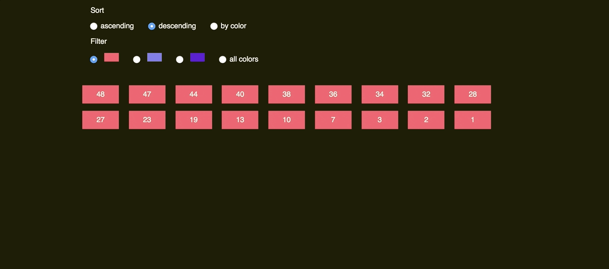

# react-flip-toolkit


### Comparison with other React FLIP libraries

| Feature                                        | `react-flip-move` | `react-overdrive` | `react-flip-toolkit` |
| ---------------------------------------------- | :---------------: | :---------------: | :------------------: |
| Animate position                               |        ✅         |        ✅         |          ✅          |
| Animate size                                   |        ❌         |        ✅         |          ✅          |
| Animate opacity                                |        ❌         |        ✅         |          ✅          |
| Animate parent's size without warping children |        ❌         |        ❌         |          ✅          |
| Use real FLIP instead of cloning & crossfading |        ✅         |        ❌         |          ✅          |
| Enable nested animations                       |        ❌         |        ❌         |          ✅          |
| Easy to set up/beginner-friendly               |        ✅         |        ✅         |          🤷          |

### Demos


- [Simplest possible example](https://codepen.io/aholachek/pen/zapEjq?editors=0110)
- [Guitar shop](https://literate-fly.surge.sh/guitar)
- [Menu with nested transitions](https://codepen.io/aholachek/pen/KeevYN?)


- [Absurd overly complex example](https://literate-fly.surge.sh/cards)
- [React-flip-toolkit logo animation](https://codepen.io/aholachek/pen/ERRpEj)

- [Sort & Filter](https://codepen.io/aholachek/pen/gKjYNw?editors=0110)


- [Photo Grid](https://literate-fly.surge.sh/photos)


### What is FLIP?

If you need a refresher, here's an article by the person who created FLIP: [Flip Your Animations](https://aerotwist.com/blog/flip-your-animations/)

## Quick start

`npm install react-flip-toolkit`

1.  Wrap your container element with a `Flipper` component that has a `flipKey` prop that changes every time an animation should happen.
2.  Wrap elements that should be animated with `Flipped` components that have `flipId` props matching them across renders.

### Simplest possible example:

[Try it out on Codepen](https://codepen.io/aholachek/pen/zapEjq?editors=0110)

```js
import { Flipper, Flipped } from "react-flip-toolkit"

const colors = ["#ff4f66", "#7971ea", "#5900d8"]

class Container extends Component {
  state = { focused: undefined }
  render() {
    return (
      <Flipper flipKey={this.state.focused}>
        <main>
          {typeof this.state.focused === "string" ? (
            <Flipped flipId={this.state.focused}>
              <div
                className="focusedItem"
                style={{ backgroundColor: this.state.focused }}
                onClick={() => this.setState({ focused: null })}
              />
            </Flipped>
          ) : (
            <ul className="list">
              {colors.map(color => (
                <Flipped flipId={color}>
                  <li
                    className="listItem"
                    style={{ backgroundColor: color }}
                    onClick={() => this.setState({ focused: color })}
                  />
                </Flipped>
              ))}
            </ul>
          )}
        </main>
      </Flipper>
    )
  }
}
```

## 1. Flipper component

The parent wrapper component that contains all the elements to be animated:

```js
<Flipper flipKey={someKeyThatChanges}>
  {/* children wrapped in Flipped components*/}
</Flipper>
```

### Props

- **required: `flipKey`**: (`string`, `number`, `bool`) Changing this tells `react-flip-toolkit` to transition child elements wrapped in `Flipped` components.
- **required: `children`**: (`node`) One or more element children
- **`ease`**: (`string`, default: `easeOutExpo`) Set the default easing for all FLIP transitions.
  [Interactive explorer for all easing options](https://codepen.io/aholachek/full/bKmZbV/)
- **`duration`**: (`number`, default: `250`) Default duration in ms for all FLIP transitions.
- **`applyTransformOrigin`**: (`bool`, default: `true`) Whether or not `react-flip-toolkit` should apply a transform-origin of "0 0" to animating children (this is generally desirable for FLIP animations)

## 2. Flipped component

A component that wraps an element that needs to be animated:

```js
<Flipped flipId="coolDiv">
  <div>animate me</div>
</Flipped>
```

### Props:

- **required: `children`**: (`node`) you have to wrap a single child with the `Flipped` component. If the child is a React component, make sure it passes down unknown props directly to the rendered DOM element so that `Flipped` can pass down the necessary `data-*` attributes.
- **required: `flipId`**: (`string`) Use this to tell `react-flip-toolkit` how elements should be matched across renders so they can be animated. E.g. in one component you can have

```js
<Flipped flipId="coolDiv">
  <div className="small" />
</Flipped>
```

and in another you can have

```js
<Flipped flipId="coolDiv">
  <div className="big" />
</Flipped>
```

and they will be tweened by `react-flip-toolkit`

- **`inverseFlipId`**: (`string`) refer to the id of the parent `Flipped` container whose transform you want to cancel out. [Read more about canceling out parent transforms here](#scale-transitions-made-easier)
- **`transformOrigin`**: (`string`, like`"50% 100%"`) this is a convenience method to apply the proper CSS `transform-origin` to the element being FLIP-ped. This will override `react-flip-toolkit`'s default application of `transform-origin: 0 0` if it is provided as a prop.
- **`ease`**: (`string`) This string should refer to [one of the available easing options]([Interactive explorer for all easing options](https://codepen.io/aholachek/full/bKmZbV/). This prop will override the easing specified in the parent `Flipped` component.
- **`duration`**: (`number`) Timing for the individual FLIP transition, this will override the one specified in the parent `Flipped` component
- **`delay`**: (`number`) Amount of time to wait before tweening the element position.
- **`onAppear(element)`** : (`func`) called when the element first appears. It is provided a reference to the DOM element being transitioned as the first argument, and the index of the element relative to all appearing elements as the second.
- **`onStart(element)`** : (`func`) called when the FLIP animation starts. It is provided a reference to the DOM element being transitioned as the first argument
- **`onComplete(element)`** : (`func`) called when the FLIP animation starts. It is provided a reference to the DOM element being transitioned as the first argument. (If transitions are interruped by new ones, `onComplete` will still be called.)

#### By default the FLIP-ped elements' translate, scale, and opacity properties are all transformed. However, certain effects require more control so if you specify any of these props, _only the specified attribute(s) will be tweened_:

- **`translate`**: (`bool`) Tween `translateX` and `translateY`
- **`scale`**: (`bool`) Tween `scaleX` and `scaleY`
- **`opacity`**: (`bool`)

#### Advanced and usually unnecessary:

- **`componentId`**: (`string`) Identify the component
- **`componentIdFilter`**: (`string`) Only apply FLIP transitions if the transition originates or ends with a component with the specified `componentId`

## Scale transitions made eas(ier)

Some other FLIP libraries just allow you to animate position changes, but things get a lot more interesting once you can animate scale changes as well ([check out the demos](#demos) to see what scale animations bring to the table).
The problem with scale animations has to do with children -- if you scale a div up 2x, you will warp any children it has by scaling them up too, creating a weird-looking animation. That's why this library allows you to wrap the child with a `Flipped` component that has an `inverseFlipId` to counteract the transforms of the parent:

```js
<Flipped flipId={parentFlipId}>
  <div>
    <Flipped inverseFlipId={parentFlipId} scale>
      <div>some text that will not be warped</div>
    </Flipped>
  </div>
</Flipped>
```

[Try it out on Codepen](https://codepen.io/aholachek/pen/mKXBJR?editors=0110)

By default, not only the scale of the parent will be counteracted, but also the translations (this allows children components to make their own FLIP animations without being affected by the parent).
But for many/most use cases, you'll want to additionally specify the `scale` prop to limit the adjustment to the scale and allow the positioning to move with the parent.

## Other details

- ~7.6kb minified and gzipped
- Requires React 16+
- Tested in latest Chrome, Firefox, Safari + Edge

## FAQ

- Q: I set up the animations but nothing is animating
- A: Make sure you're updating the `flipKey` attribute in the `Flipper` component whenever an animation should happen.
