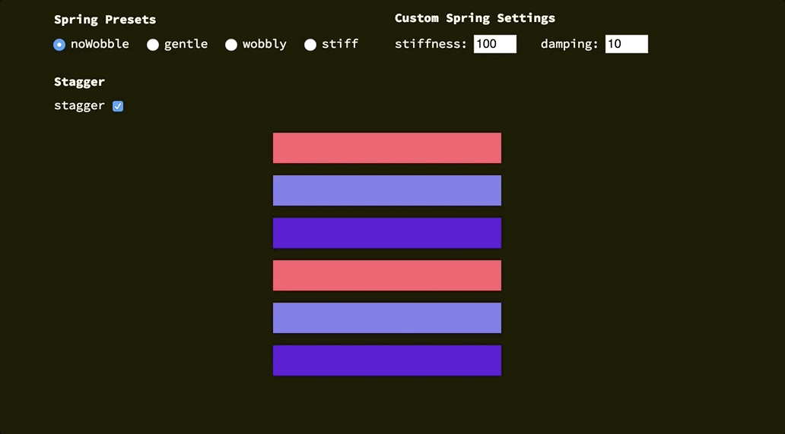
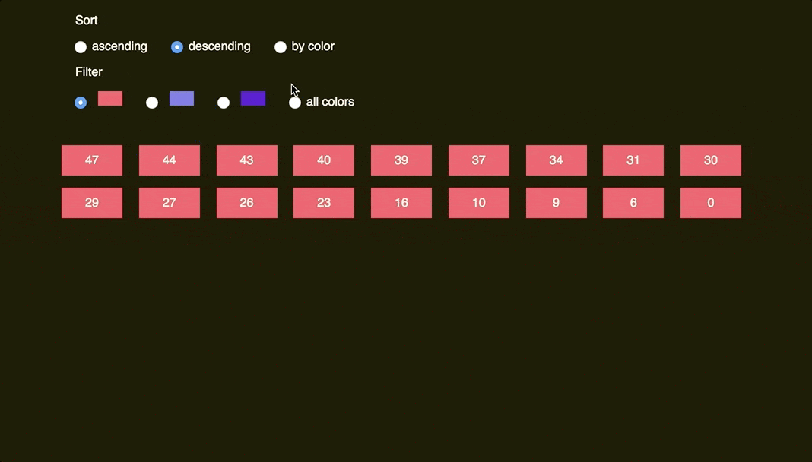
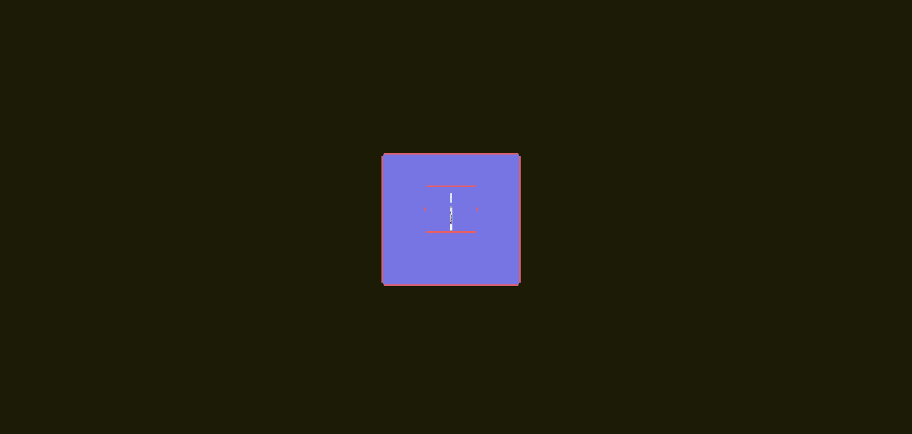
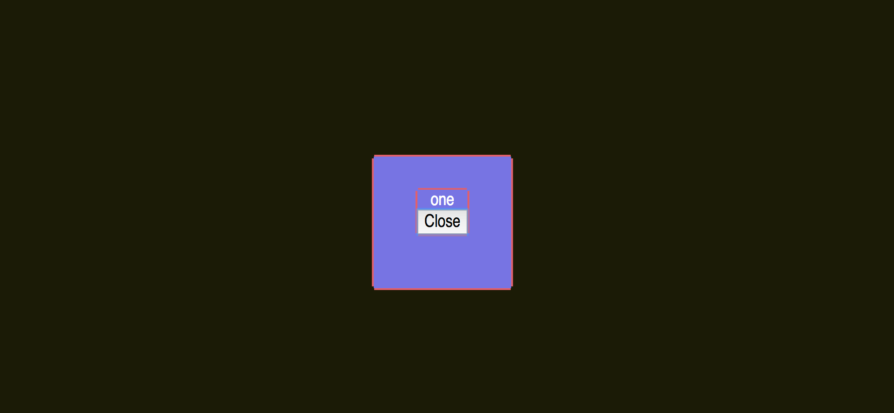

# react-flip-toolkit

🆕 The 4.0.0 version was recently released. For information about breaking changes, check out the [changelog](./CHANGELOG.md).

<a href="https://codepen.io/aholachek/pen/ERRpEj">

</a>

## Comparison with other React FLIP libraries

| Feature                                        | [`react-flip-move`](https://github.com/joshwcomeau/react-flip-move) | [`react-overdrive`](https://github.com/berzniz/react-overdrive) | `react-flip-toolkit` |
| ---------------------------------------------- | :-----------------------------------------------------------------: | :-------------------------------------------------------------: | :------------------: |
| Animate position                               | ✅                                                                   | ✅                                                               | ✅                    |
| Animate size                                   | ❌                                                                   | ✅                                                               | ✅                    |
| Animate opacity                                | ❌                                                                   | ✅                                                               | ✅                    |
| Animate parent's size without warping children | ❌                                                                   | ❌                                                               | ✅                    |
| Use real FLIP instead of cloning & crossfading | ✅                                                                   | ❌                                                               | ✅                    |
| Enable nested animations                       | ❌                                                                   | ❌                                                               | ✅                    |
| Use springs for animations                     | ❌                                                                   | ❌                                                               | ✅                    |
| Easy to set up & beginner-friendly             | ✅                                                                   | ✅                                                               | 🤷                   |


## Table of Contents
- [Demos](#demos)
- [Quick start](#quick-start)
  - [Simplest example: tweening a single element](#simplest-example-tweening-a-single-element)
  - [More useful: tweening different elements](#more-useful-tweening-different-elements)
- [The Components](#the-components)
  - [1. `Flipper`](#1-flipper)
    - [Props](#props)
  - [2. `Flipped`](#2-flipped)
    - [Basic props](#basic-props)
    - [Callback props](#callback-props)
    - [Transform props](#transform-props)
    - [Advanced props](#advanced-props)
- [Scale transitions made eas(ier)](#scale-transitions-made-easier)
- [Library details](#library-details)
- [Troubleshooting](#troubleshooting)

## Demos

<p>
<a href="https://literate-fly.surge.sh/photos">
  
</a>
</p>

<p>
<a href="https://codepen.io/aholachek/pen/KeevYN">
  
</a>
</p>

- [Updating list (`react-flip-move` example clone)](https://literate-fly.surge.sh/flip-move)
- [Simplest possible example](https://codepen.io/aholachek/pen/oyKJgL)
- [Guitar shop](https://literate-fly.surge.sh/guitar)
- [Overly complex, nested cards example](https://literate-fly.surge.sh/cards)
- [React-flip-toolkit logo](https://codepen.io/aholachek/pen/ERRpEj)
- [Using Portals](https://literate-fly.surge.sh/portal)

<p>
Spring options explorer:
<a href="https://codepen.io/aholachek/pen/gKjYNw?editors=0110">
  
</a>
</p>

## Quick start

`npm install react-flip-toolkit`

Wrap your container element with a `Flipper` component that has a `flipKey` prop that changes every time an animation should happen.

Wrap elements that should be animated with `Flipped` components that have `flipId` props matching them across renders.

### Simplest example: tweening a single element

```jsx
import React, { Component } from React;
import { Flipper, Flipped } from 'react-flip-toolkit';

class AnimatedSquare extends Component {
  state = { fullScreen: false };

  toggleFullScreen = () => {
    this.setState(prevState => ({
      fullScreen: !prevState.fullScreen
    }));
  };

  render() {
    return (
      <Flipper flipKey={this.state.fullScreen}>
        <Flipped flipId="square">
          <div
            className={this.state.fullScreen ? "full-screen-square" : "square"}
            onClick={this.toggleFullScreen}
          />
        </Flipped>
      </Flipper>
    );
  }
}
```

[view on Codepen](https://codepen.io/aholachek/pen/oyKJgL)

### More useful: tweening different elements

The power of FLIP lies in smoothly tweening two completely separate elements to appear as if they are one:

```jsx
import React, { Component } from React;
import { Flipper, Flipped } from 'react-flip-toolkit';

const SmallSquare = ({ onClick }) => (
  <Flipped flipId="square">
    <div className="square" onClick={onClick} />
  </Flipped>
);

const BigSquare = ({ onClick }) => (
  <Flipped flipId="square">
    <div className="full-screen-square" onClick={onClick}/>
  </Flipped>
);

class AnimatedSquare extends Component {
  state = { fullScreen: false };

  toggleFullScreen = () => {
    this.setState(prevState => ({
      fullScreen: !prevState.fullScreen
    }));
  };

  render() {
    return (
      <Flipper flipKey={this.state.fullScreen}>
        {this.state.fullScreen ? (
          <BigSquare onClick={this.toggleFullScreen} />
        ) : (
          <SmallSquare onClick={this.toggleFullScreen} />
        )}
      </Flipper>
    );
  }
}
```
[view on Codepen](https://codepen.io/aholachek/pen/qKeLaN)


## The Components

### 1. `Flipper`

The parent wrapper component that contains all the elements to be animated.

```jsx
<Flipper flipKey={someKeyThatChanges}>
  {/* children */}
</Flipper>
```

#### Props

| prop                    | default    | type                       | details                                                                                                                                                                                                                                                                                                                                                                                                                                                            |
| ----------------------- | :--------: | :------------------------- | :----------------------------------------------------------------------------------------------------------------------------------------------------------------------------------------------------------------------------------------------------------------------------------------------------------------------------------------------------------------------------------------------------------------------------------------------------------------- |
| flipKey **(required)**  | -          | `string`, `number`, `bool` | Changing this tells `react-flip-toolkit` to transition child elements wrapped in `Flipped` components.                                                                                                                                                                                                                                                                                                                                                             |
| children **(required)** | -          | `node`                     | One or more element children                                                                                                                                                                                                                                                                                                                                                                                                                                       |
| spring                  | `noWobble` | `string` or `object`       | Provide a string referencing one of the spring presets &mdash; `noWobble` (default), `gentle`, `wobbly`, or `stiff`, OR provide an object with stiffness and damping parameters. [Explore the spring setting options here.](https://codepen.io/aholachek/full/bKmZbV/) The prop provided here will be the spring default that can be overrided on a per-element basis on the `Flipped` component.                                                                  |
| applyTransformOrigin    | `true`     | `bool`                     | Whether or not `react-flip-toolkit` should apply a transform-origin of "0 0" to animating children (this is generally, but not always, desirable for FLIP animations)                                                                                                                                                                                                                                                                                              |
| element                 | `div`      | `string`                   | If you'd like the wrapper element created by the `Flipped` container to be something other than a `div`, you can specify that here.                                                                                                                                                                                                                                                                                                                                |
| className               | -          | `string`                   | A class applied to the wrapper element, helpful for styling.                                                                                                                                                                                                                                                                                                                                                                                                       |
| portalKey               | -          | `string`                   | In general, the `Flipper` component will only apply transitions to its descendents. This allows multiple `Flipper` elements to coexist on the same page, but it will prevent animations from working if you use [portals](https://reactjs.org/docs/portals.html). You can provide a unique `portalKey` prop to `Flipper` to tell it to scope element selections to the entire document, not just to its children, so that elements in portals can be transitioned. |
| debug                   | `false`    | `bool`                     | This experimental prop will pause your animation right at the initial application of FLIP-ped styles. That will allow you to inspect the state of the animation at the very beginning, when it should look similar or identical to the UI before the animation began.                                                                                                                                                                                              |


### 2. `Flipped`

Wraps an element that should be animated.

E.g. in one component you can have

```jsx
<Flipped flipId="coolDiv">
  <div className="small" />
</Flipped>
```

and in another component somewhere else you can have

```jsx
<Flipped flipId="coolDiv">
  <div className="big" />
</Flipped>
```

and they will be tweened by `react-flip-toolkit`.

The `Flipped` component produces no markup, it simply passes some props down to its wrapped child. If the child is a React component, make sure it passes down unknown props directly to the rendered DOM element.

#### Basic props

| prop                    | default    | type                  | details                                                                                                                                                                                                                                                                                                                         |
| ----------------------- | :--------: | :-------------------- | :------------------------------------------------------------------------------------------------------------------------------------------------------------------------------------------------------------------------------------------------------------------------------------------------------------------------------ |
| children **(required)** | -          | `node`                | Wrap a single child with the `Flipped` component.                                                                                                                                                                                                                                                                               |
| flipId **(required)**   | -          | `string`              | Use this to tell `react-flip-toolkit` how elements should be matched across renders so they can be animated.                                                                                                                                                                                                                    |
| inverseFlipId           | -          | `string`              | Refer to the id of the parent `Flipped` container whose transform you want to cancel out. [Read more about canceling out parent transforms here.](#scale-transitions-made-easier)                                                                                                                                               |
| transformOrigin         | `"0 0"`    | `string`              | This is a convenience method to apply the proper CSS `transform-origin` to the element being FLIP-ped. This will override `react-flip-toolkit`'s default application of `transform-origin: 0 0;` if it is provided as a prop.                                                                                                   |
| spring                  | `noWobble` | `string` or `object`  | Provide a string referencing one of the spring presets &mdash; `noWobble` (default), `gentle`, `wobbly`, or `stiff`, OR provide an object with stiffness and damping parameters. [Explore the spring setting options here.](https://codepen.io/aholachek/full/bKmZbV/)                                                          |
| stagger                 | `false`    | `boolean` or `string` | Provide a natural, spring-based staggering effect in which the spring easing of each item is pinned to the previous one's movement. Provide `true` to stagger the element with all other staggered elements. If you want to get more granular, you can provide a string key and the element will be staggered with other elements with the same key. |

#### Callback props

<p>
<a href="https://codepen.io/aholachek/pen/gKjYNw?editors=0110">
  <figure>
  
  <figcaption>This animation uses onAppear and onExit callbacks for fade-in and fade-out animations.</figcaption>
  </figure>

</a>
</p>

| prop            | arguments                           | details                                                                                                                                                                                                                                                                                         |
| --------------- | :---------------------------------- | :---------------------------------------------------------------------------------------------------------------------------------------------------------------------------------------------------------------------------------------------------------------------------------------------- |
| onAppear        | `element`, `index`                  | Called when the element first appears. It is provided a reference to the DOM element being transitioned as the first argument, and the index of the element relative to all appearing elements as the second.                                                                                   |
| onDelayedAppear | `element`, `index`                  | This is a replacement for  `onAppear` that is called only after all exiting elements have finished exiting. It automatically applies `opacity: 0` to newly appeared elements at the very beginning. The `onDelayedAppear` function is responsible for setting the `opacity` to the final value. |
| onStart         | `element`                           | Called when the FLIP animation starts. It is provided a reference to the DOM element being transitioned as the first argument                                                                                                                                                                   |
| onComplete      | `element`                           | Called when the FLIP animation completes. It is provided a reference to the DOM element being transitioned as the first argument. (If transitions are interruped by new ones, `onComplete` will still be called.)                                                                               |
| onExit          | `element`, `index`, `removeElement` | Called when the element is removed from the DOM. It must call the `removeElement` function when the exit transition has completed.                                                                                                                                                              |

#### Transform props

By default the FLIP-ped elements' translate, scale, and opacity properties are all transformed. However, certain effects require more control so if you specify any of these props, _only the specified attribute(s) will be tweened_:

| prop      | type   | details                             |
| --------- | :----: | :---------------------------------- |
| translate | `bool` | Tween `translateX` and `translateY` |
| scale     | `bool` | Tween `scaleX` and `scaleY`         |
| opacity   | `bool` |                                     |

#### Advanced props

| prop              | type             | details                                                                                                                                                                                                                                                                                                                                     |
| ----------------- | :--------------: | :------------------------------------------------------------------------------------------------------------------------------------------------------------------------------------------------------------------------------------------------------------------------------------------------------------------------------------------ |
| componentId       | `string`         | Unique identifier for the component                                                                                                                                                                                                                                                                                                         |
| componentIdFilter | `array`,`string` | Only apply FLIP transitions if the transition originates or ends with a component with the specified `componentId`. To limit the application of an inverse transform, you refer to the parent's `componentId` [as seen in this example.](https://github.com/aholachek/react-flip-toolkit/blob/master/demo/src/CardsExample/UserGrid.js#L44) |

## Scale transitions made eas(ier)

Some other FLIP libraries just allow you to animate position changes, but things get more interesting [once you can animate scale changes as well](#demos).

<a href="https://codepen.io/aholachek/pen/mKXBJR?editors=0110">

</a>

[view on Codepen](https://codepen.io/aholachek/pen/mKXBJR)

The problem with scale animations has to do with children &mdash; if you scale a div up 2x, you will warp any children it has by scaling them up too, creating a weird-looking animation. That's why this library allows you to wrap the child with a `Flipped` component that has an `inverseFlipId` to counteract the transforms of the parent:

```jsx
<Flipped flipId={parentFlipId}>
  <div>
    <Flipped inverseFlipId={parentFlipId} scale>
      <div>some text that will not be warped</div>
    </Flipped>
  </div>
</Flipped>
```

By default, both the scale and the translation transforms of the parent will be counteracted (this allows children components to make their own FLIP animations without being affected by the parent).
But for many/most use cases, you'll want to additionally specify the `scale` prop to limit the adjustment to the scale and allow the positioning to move with the parent.

**For the most seamless results** the DOM element with the inverse transform applied should lie flush against its parent container &mdash; that means any padding should be applied to the inverted container rather than the parent container.

## Library details

- ~7kb minified and gzipped
- React 16+
- Tested in latest Chrome, Firefox, Safari, and Edge. Seems to work ok in IE 11.
- Uses [Rematrix](https://github.com/jlmakes/rematrix) for matrix calculations and [Wobble](https://github.com/skevy/wobble) for spring animations.

## Troubleshooting

### Problem #1: Nothing is happening:
  - Make sure you're updating the `flipKey` attribute in the `Flipper` component whenever an animation should happen.
  - If one of your `Flipped` components is wrapping another React component rather than a DOM element, make sure that component passes down unknown props directly to its DOM element, e.g.: `<div className="square" {...rest} />`

### Problem #2: Things look weird:
  - At any point, there can only be one element with a specified `flipId` on the page. If there are multiple `Flipped` elements on the page with the same id, the animation will break. Check to make sure all `flipId`s are unique.
  - Make sure you are animating the element you want to animate and not, for instance, a wrapper div. For instance, if you are animating an inline element like some text, but have wrapped it in a `div`, you're actually animating the div, which might have a much wider width that you'd expect at certain points, which will throw off the animation. Check to see if you need to add an  `inline-block` style to the animated element.

### It's still not working: try out the `debug` prop

If you still can't figure out what's going wrong, you can add the [the `debug` prop](#props)  directly on your `Flipper` component to pause transitions at the beginning and outline the `Flipped` components with a hot pink outline. Here's an example of solving a problem with the `debug` prop:

The broken animation:


Apply the debug prop to have the FLIP animation pause at the very beginning:



We see here that the pink outline surrounding the center contents extends much further than the actual text and button. It turns out that we're flipping a wrapper `div` rather than the actual text and button:

```jsx
<Flipped flipId='contentContainer'>
  <div>
    <p>{this.props.text}</p>
    <button onClick={this.toggleFullscreen}>Close</button>
  </div>
</Flipped>
```

We can either wrap both the `p` and the `button` in their own `Flipped ` containers, or add a style of `inline-block` on the wrapper `div`. To verify once we add the fix, we can rerun the animation with the `debug` prop applied:



Now, the pink outline is hugging the elements that are being animated, so they are no longer getting warped.

